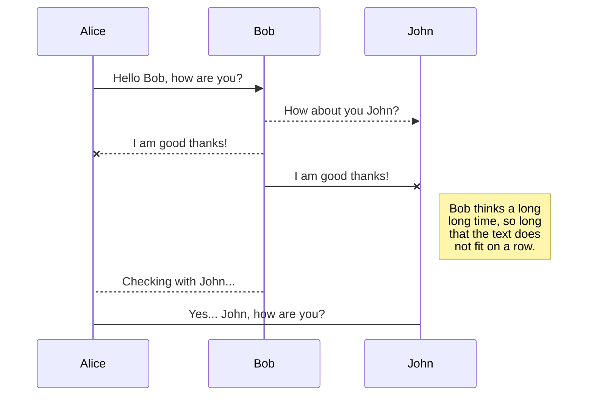

If we wanted to put example code in the site for the edification of readers, we could do so:
```html
<!-- required -->
<!doctype html>

<!-- required -->
<html lang="en">

<head>
    <!-- required -->
    <meta charset="utf-8">
    <!-- required -->
    <meta name="viewport" content="width=device-width, initial-scale=1, shrink-to-fit=no">
    <!-- required -->
    <meta name="description" content="A short description of the page">
    <!-- required -->
    <meta name="author" content="Brown University Library">
    <!-- required -->
    <title>The page title</title>
    <!-- not required, will almost certainly appear -->
    <link type="text/css" rel="stylesheet" media="screen" href="/css/style.css'" />
</head>
```
The code highlighter Chroma [supports ~200 languages](https://gohugo.io/content-management/syntax-highlighting/#list-of-chroma-highlighting-languages).

Lotus Docs supports use of [mermaid](https://mermaid.js.org/):

